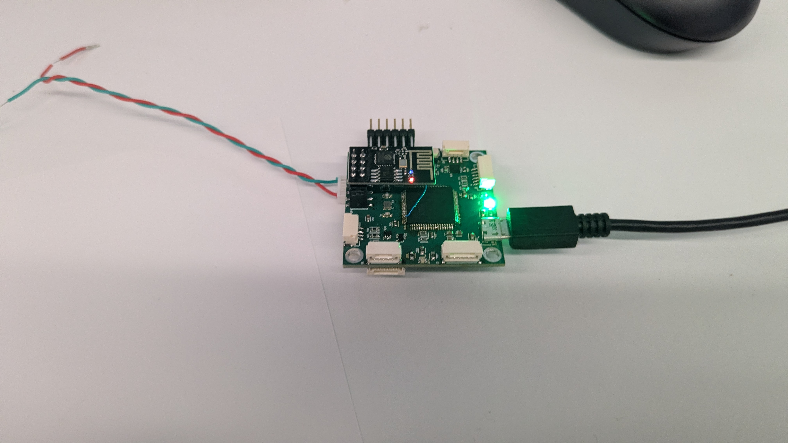
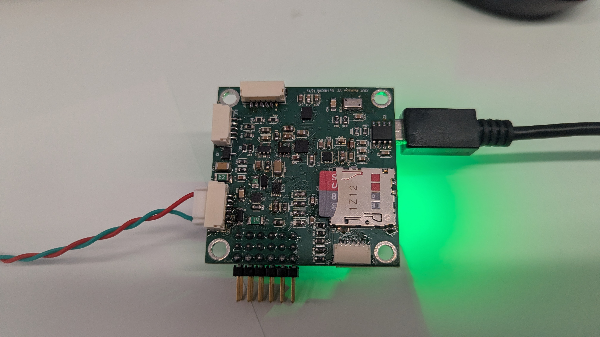
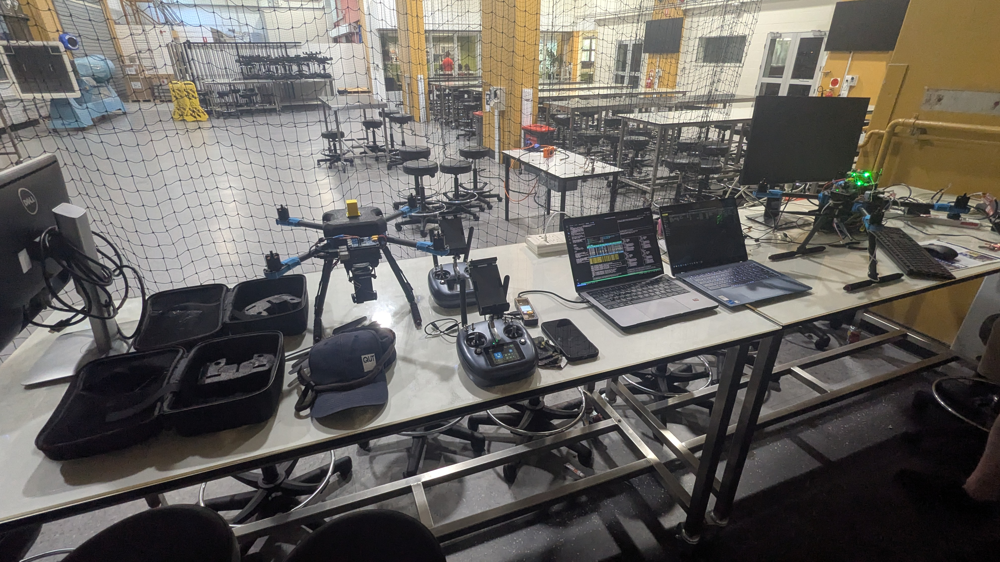
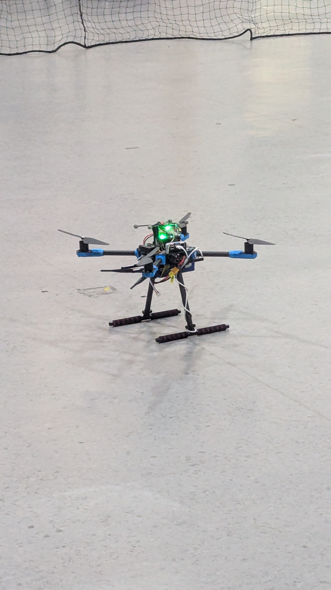

# QUT Open Source Autopilot (QUTOpenSourceFCU)

## 🏛️ University Property & Acknowledgement
**This project and its contents have been supported by the Queensland University of Technology (QUT)**. 
It was developed as an in-house hardware solution for UAV units at QUT. QUT acknowledges the Turrbal and Yugara, as the First Nations owners of the lands where QUT now stands. 

##  Project Overview
This project involves refactoring, building, programming, and testing an open-source flight module design to serve as a replacement for current hardware. The primary objective is to create an alternative to the difficult-to-source off-the-shelf Pixhawk 6. This work builds upon the v1 version produced by KAI (Wesley) in 2022.

The final demonstrator capabilities include:
* Loading open-source firmware with customizations.
* Connecting to QGroundControl.
* Basic operations for manned flight on a simple airframe.
* Autonomous flight via ros2 and internal positioning system

##  Hardware Specifications & Modifications
The core design is based on the AUAV Pixracer, which is the FMUv4 generation of Pixhawk autopilots. 
* **Main System-on-Chip**: STM32F427VIT6 rev.3 CPU (180 MHz ARM Cortex® M4).
* **v2 Sensor Suite**: Invensense ICM-42688-p (Accel / Gyro), Invensense ICM-20608-G (Accel / Gyro), MS561101BA03-50 (Barometer), and LIS3MDLTR (Mag).
* **v2 Board Modifications**: The design includes small placement changes to the SD card, C, and R components. It also introduces new interfaces, including a Reset Button and a BOOT0 Button.

##  Firmware
* The PX4 firmware is loaded onto the STM chip using DFU.
* Small modifications were required for drivers and SPI chip select pins.
* Mavlink 8266 firmware was utilized for the external WiFi ESP-01 module.
* Custom firmware was also designed to test sensor communication, using the onboard LED to display different colors for different communication failures.

##  Current Issues & Future Work (v3 Development)
### Known Board Issues (v2)
* The D4 label is missing from the board.
* The labels are too small to read.
* There is no thermal relief on the ground pads, and the board name is out of date.
* The USB data lines are not the same length.
* One of the accelerometer sensors needs to be rotated 90 degrees.
* A breakout for serial debugging output needs to be added.
* The SD card footprint should be reversed for better access.
* The STM chip is not connected to 3.3v.

### Future Work
* Flight testing the prototype to test design validity.
* Fixing the outlined issues and setting up external production.
* Designing an outer case with proper sensor specs, including barometer foam protection and chip vibration isolation techniques.
* Validating external component connections, PX4 firmware, and QGroundControl configurations.
* Considering turning the design into a Pi header with required isolation.

## 📸 Project Showcase
Operation videos and development images can be found inside the .zip file in the Showcase folder
* 
* 
* 
* 
* 

##  Author Credentials
**Name:** Joshua Hecke
**Student ID:** n11585382
**Role:** Project Developer 

  

## 📄 License Disclaimer
The base AUAV Pixracer is an open hardware design licensed under the Creative Commons Attribution-ShareAlike 3.0 Unported (CC BY-SA 3.0) license.